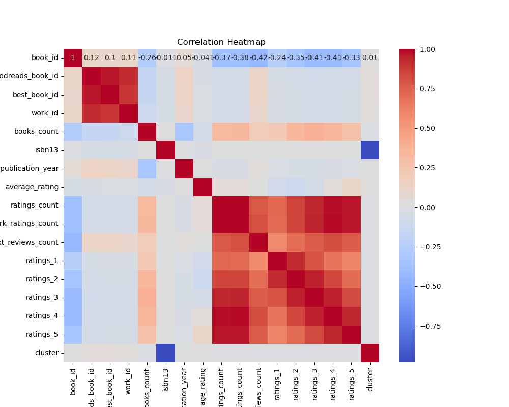
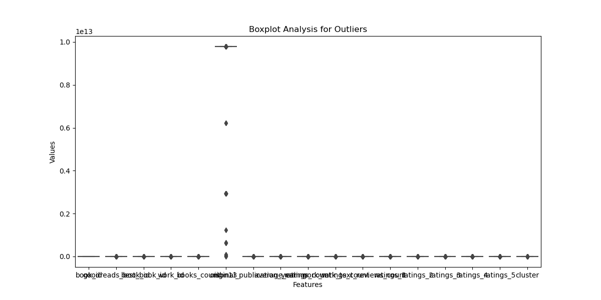
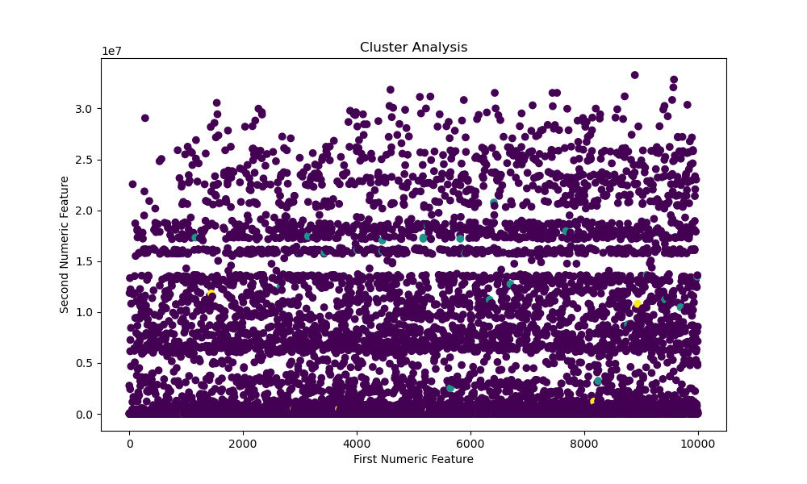

# Dataset Analysis Report

## 1. Analysis Story
### Story of Data Discovery

#### Chapter 1: The Data Received

In the digital realm of literature, a vast dataset was unearthed, containing intricate details about books galore. With 10,000 rows and 23 columns, it promised a treasure trove of insights waiting to be unveiled. The dataset boasted unique identifiers like 'book_id,' 'goodreads_book_id,' and 'work_id,' as well as rich information about authors, publication years, and ratings, encompassing various facets of reader engagement. 

As the dataset was loaded for analysis, the excitement was palpable. It featured the allure of authors' names, the year a captivating story was first published, the average ratings that tell tales of readers' affection, and a rainbow of genres implicit in the 'language_code.' All this data was an invitation to explore the world of books and their reception amongst readers.

#### Chapter 2: The Analysis Carried Out

Equipped with analytical tools, the examination commenced. A basic analysis was performed first, producing a summary packed with statistics that described the books' characteristics. It revealed that while most metadata was present across the dataset, columns such as 'isbn' and 'isbn13' reflected some missing values, highlighting areas for further exploration.

Advanced analytical techniques followed. Outlier detection flagged 662 entries that deviated significantly from established norms—potentially revealing either extraordinary popularity or erroneous data entries. Clustering analyses formed distinct groups, illuminating patterns hidden amongst the structured chaos of numbers. Regression analysis, with its elegant coefficients, provided possible relations between variables like ratings count and average ratings, teasing out the complexities of reader evaluation.

#### Chapter 3: Insights Discovered

The analysis bore fruit in the form of concrete insights. Notably, it was found that the average rating of books hovered around 4.0, suggesting a generally positive reception among readers. However, with over 5,000 'ratings_count' seen in some instances alongside ratings that reached jaw-dropping heights—like 4.82—the possibility of best-seller phenomena or outlier popularity was underscored.

The investigation threw light on authors, finding 'Stephen King' leading the author list, with others trailing but contributing richly to the overall landscape of literature. The original publication years showed a long-standing tapestry of literary offerings, some published as far back as 1750, while others were contemporary works released only a few years prior.

Furthermore, the distinct clusters identified pointed towards diverse themes or genres of literature, beckoning a deeper understanding of what resonated with readers most fervently.

#### Chapter 4: Implications of the Findings and Suggested Next Steps

With this analytical odyssey concluded, the implications of the findings stretched far and wide. Publishers can glean insights into which genres are currently thriving based on ratings counts and author popularity, possibly redirecting marketing efforts to optimize outreach. Libraries and bookstores can leverage readers' preferences to curate offerings that align with current trends.

For future investigations, a recommendation emerges: delve deeper into the detected outliers to determine if they represent unique cultural phenomena or potential data inaccuracies. A comparative analysis to track changes in ratings over time could yield powerful narratives about evolving reader expectations and tastes.

Moreover, utilizing natural language processing techniques to analyze reviews could add dimensions to understanding reader sentiment, revealing not only what books resonate but why they do. Engaging with readers through surveys or social media could provide qualitative data that complements the quantitative findings, creating a full-bodied portrait of contemporary literature.

As the curtain fell on this chapter of exploration, it became clear that the world of books is as dynamic and multifaceted as its audience, waiting for another round of insightful analysis to continue unveiling its stories.

## 2. Visualizations

