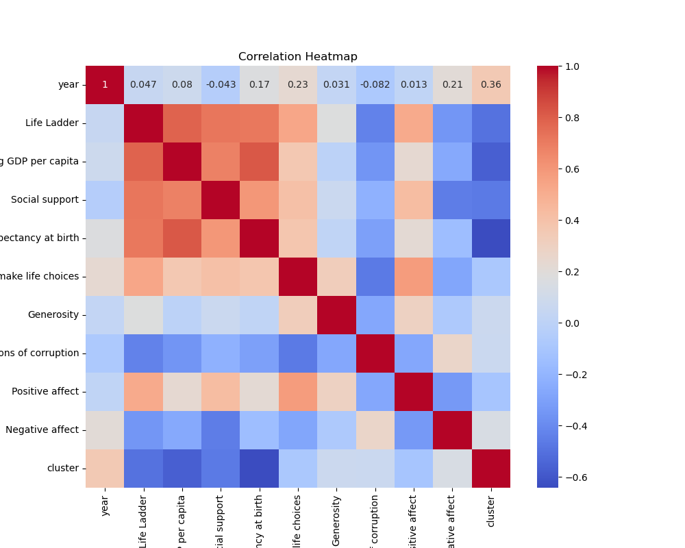
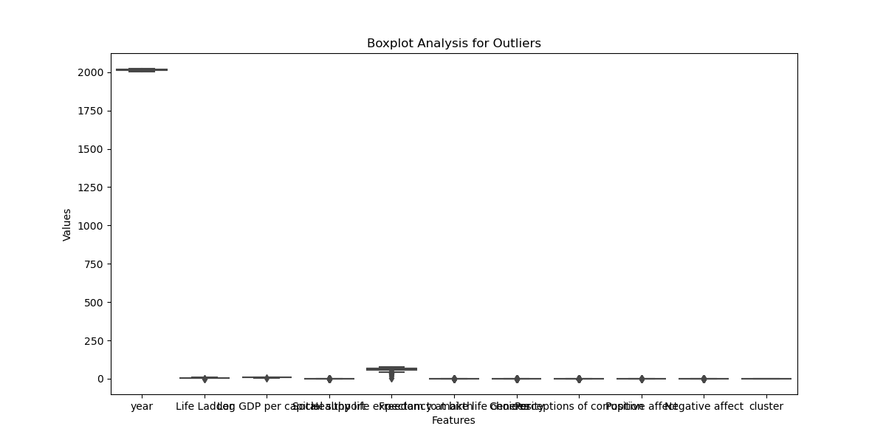
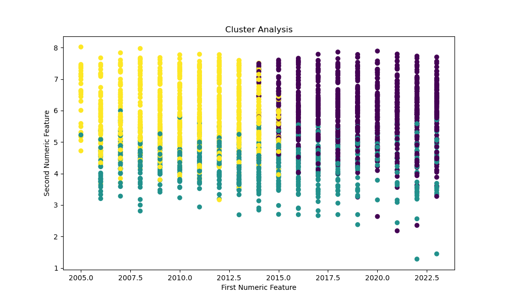

# Dataset Analysis Report

## 1. Analysis Story
### A Story of Data and Insights: Understanding Global Well-being

#### 1. The Data Received
In the realm of data analytics, a compelling dataset was presented for analysis, encompassing an intriguing 2363 rows and 11 columns. Each row represented qualitative and quantitative facets of life across 165 countries, reflected through various indicators like the Life Ladder, Log GDP per capita, Social support, and other factors influencing the holistic view of well-being. Curiously, these columns were a mix of empirical measurements of life quality and subjective perceptions, informing about happiness and societal health through the lenses of economic performance, social fabric, and personal freedoms. These attributes offered a robust foundation to explore the intricacies of global happiness and well-being.

#### 2. The Analysis Carried Out
The analytical journey began with basic exploration—summary statistics revealed the structure and variability within the data. Notably, missing values were observed, especially in aspects like Log GDP per capita and Generosity, indicating potential gaps in economic reporting or data collection methods. 

Diving deeper, advanced analytical techniques were employed, such as outlier detection, which flagged 279 potential anomalies, hinting at trends that deviated significantly from the norm. Clustering analysis illuminated three distinct groupings of data, depicting various states of well-being across different years, linking them to notable economic and social indicators.

Regression analysis further elucidated relationships between factors, presenting coefficients that suggested nuanced interactions between economic performance, social support, and individual freedoms. For example, the negative coefficient associated with Perceptions of corruption illuminated an overarching theme—higher corruption perceptions could detrimentally affect societal happiness.

#### 3. The Insights Discovered
The analysis culminated in revealing poignant insights about global well-being. The average Life Ladder score stood at 5.48, suggesting that, while many countries enjoy a moderately positive perception of life, there is ample room for growth towards the ideal. Closer examination pointed out that nations with higher Log GDP per capita tended to correlate positively with life satisfaction, yet this connection was far from straightforward due to the influence of other social factors.

Countries exhibited differing levels of social support and freedom, implying that money alone does not equate to happiness. The data suggested a more complex interplay where social systems and the availability of choices contribute significantly to individual happiness. Notably, a trend emerged that connected high life satisfaction with lower perceptions of corruption and increased freedom to make choices, suggesting that aside from economic prosperity, trust in institutions and personal liberties are paramount to enhancing societal well-being.

#### 4. Implications of the Findings and Suggested Next Steps
These insights have profound implications for policymakers and organizations aiming to improve quality of life within their countries. Initiatives that foster transparency, reduce corruption, and enhance personal freedoms can, according to the data, lead to improved happiness. 

Furthermore, collaborations across nations could capitalize on data-driven policies that blend economic growth strategies with social support systems capable of addressing citizens' needs holistically. For instance, investing in mental health and community-building initiatives could fortify social bonds, further enhancing the well-being of citizens.

As a next step, further exploration into longitudinal data could verify if these trends are consistent over time. Conducting surveys that emphasize personal experiences and feelings could enrich the dataset, providing deeper insights into the subjective well-being of individuals. 

Importantly, creating dashboards or interactive platforms that visualize these insights could engage stakeholders more effectively, allowing governments and organizations to react promptly and responsibly to the dynamic facets of human well-being. Ultimately, the goal remains clear: translating data insights into actionable strategies that foster a happier, healthier world.

## 2. Visualizations

