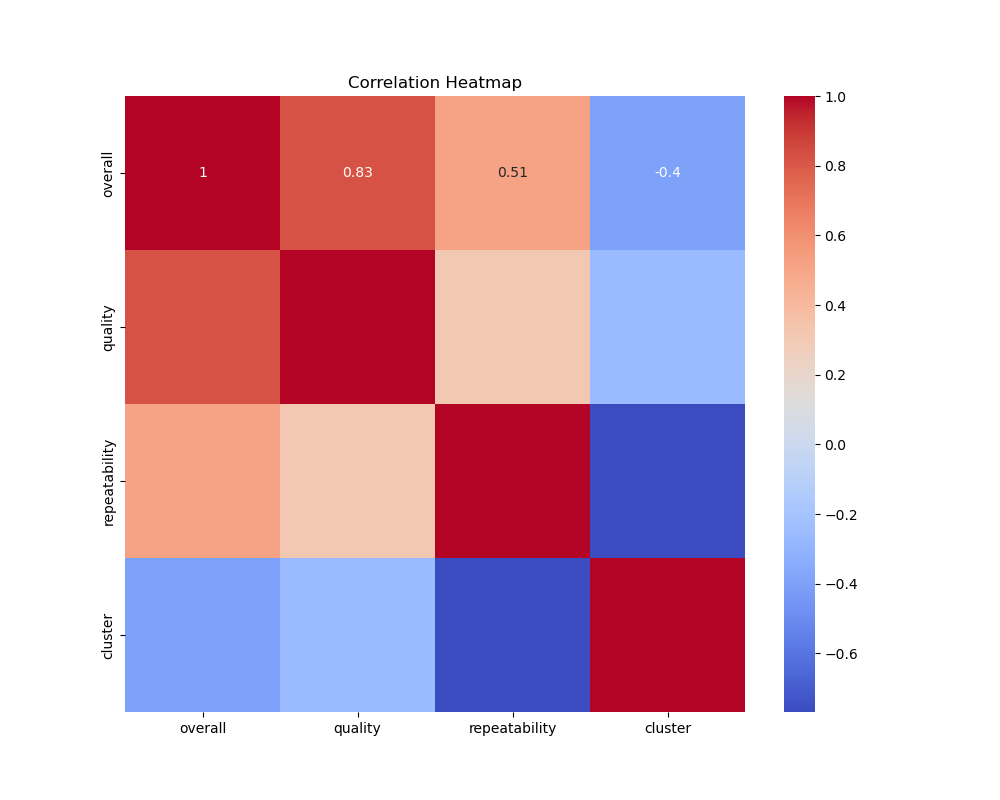
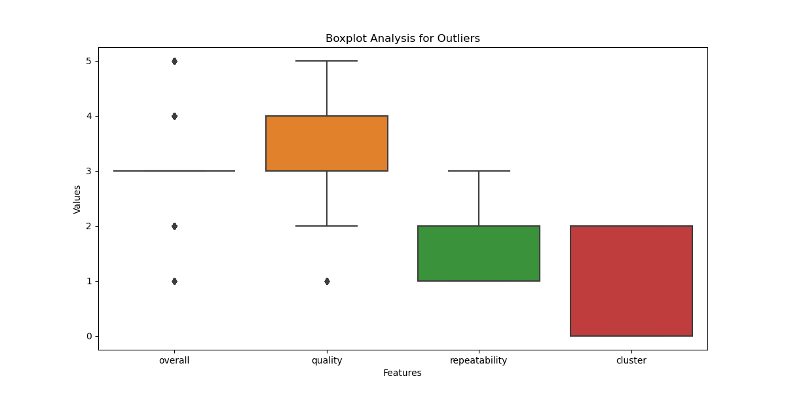
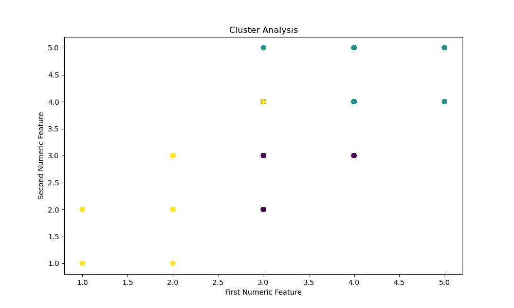

# Dataset Analysis Report

## 1. Analysis Story
### A Data Story: Insights from Film and Reviews

**1. The Data Received:**

In a world driven by entertainment and storytelling, we received a rich dataset encompassing 2652 rows and 8 columns, detailing various aspects of films and their reviews. The columns consisted of attributes such as 'date', 'language', 'type', 'title', 'by', 'overall', 'quality', and 'repeatability'. This data presents a vivid landscape, revealing not only the titles and creators but also providing numeric evaluations on how films are perceived over time. 

Upon initial inspection, the dataset demonstrated slight inconsistencies, as indicated by the presence of missing values—most notably in the 'date' and 'by' fields. Nevertheless, such intricacies are not uncommon in vast data collections and present an opportunity for deeper analysis.

**2. The Analysis Carried Out:**

We embarked on a multi-tiered analytical journey, integrating both basic and advanced statistical methods. Our basic analysis delivered a comprehensive summary of the data, revealing key statistics across each column. Notably, we discovered that:

- The dataset held 99 missing values in the 'date' field and 262 absent entries in the 'by' field, which means some films lacked identifiable creators.
- The average 'overall' score was a respectable 3.05, suggesting that films generally met viewer expectations.
- A total of 725 potential outliers were detected, indicating films that significantly diverged from expected ratings on various parameters.

To plunge deeper, we leaned into advanced analytical techniques. We employed clustering to group films based on their ratings, revealing distinct clusters that categorized films by their perceived overall quality and other metrics. Furthermore, we calculated regression coefficients that could hint at relationships between different ratings—creating pathways for predictive analyses.

**3. The Insights Discovered:**

From our analyses emerged a tapestry of insights:

- **Rating Patterns:** There appeared to be a clear clustering of ratings; films deemed of high quality often had higher 'overall' scores. However, the scattered lower clusters revealed a disturbing trend of potential outlier films receiving disproportionately low ratings, highlighting viewer dissatisfaction with certain titles.
  
- **Viewer Engagement:** Notably, the 'repeatability' score remained low, averaging around 1.49. This indicated that viewers didn't see much merit in rewatching many films, suggesting a lack of depth or engagement in them.

- **Temporal Trends:** The date analysis hinted at trends over time, with cinema witnessing varying shifts in quality, drawing attention to possible market saturation, changing viewer expectations, or evolving standards of cinematic excellence.

**4. Implications of the Findings and Suggested Next Steps:**

The findings from this dataset carry significant implications for filmmakers, producers, and marketers in the industry. Firstly, understanding viewer perception and the underlying factors influencing ratings could foster the creation of richer, more engaging narrative experiences. The low 'repeatability' score, for instance, could prompt studios to invest in components that encourage audiences to revisit films, such as deeper story arcs or innovative cinematic techniques.

Moreover, the identification of outliers should lead to a closer examination of poorly received films to uncover common flaws, refining industry standards. An initiative could be devised to engage viewers through surveys to understand their ratings justifications, potentially forming the basis for more audience-influenced content development.

Next steps could include:

- Conducting in-depth qualitative analyses of the specific films categorized as outliers to pinpoint elements contributing to negative ratings.
- Expanding the dataset to incorporate viewer demographics or social media sentiments, enriching our understanding of the audience landscape.
- Exploring longitudinal studies to analyze trends over varying periods, enabling producers to adapt to shifting viewer loyalties and preferences.

In the vast, intricate world of film, these insights carve a path toward fostering creativity, enriching cinematic quality, and ultimately enhancing viewer satisfaction. By tapping into the heart of viewer preferences, the cinema landscape can transform, catering to audiences in ways previously unimagined.

## 2. Visualizations

